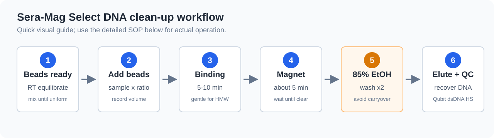

::: {.callout-note appearance="simple"}
本頁整理以 **Sera-Mag Select beads** 進行 DNA / cDNA / amplicon clean-up 的操作原則，作為 Nanopore 建庫前與建庫中 clean-up 的參考。  
本頁不是 ONT 官方 protocol；若 kit protocol 已指定 AMPure XP、SPRIselect、SFB、LFB 或其他 beads / buffer，仍以該 kit protocol 為主。
:::

::: {.callout-important}
本頁預設對象是 **DNA、PCR product、amplicon、post-PCR amplified cDNA**。  
不要把本頁直接套用到 RNA input clean-up；RNA 樣本需要使用 RNA-compatible cleanup method，並重新確認 RNA recovery、fragment profile 與 downstream kit compatibility。
:::

## 適用情境

| 情境 | 是否適合 | 重點 |
|:---|:---:|:---|
| PCR product clean-up | 適合 | 去除 primer、dNTP、enzyme、buffer salts |
| 16S / ITS amplicon clean-up | 適合 | 依 amplicon 長度選擇 ratio，避免過度丟失短 amplicon |
| cDNA-PCR amplified cDNA clean-up | 適合 | PCR 後以 Qubit dsDNA HS + size profile 判斷是否可進 adapter attachment |
| gDNA clean-up | 可用，但需保守 | HMW DNA 容易因混勻、吸打、乾燥過度而 shearing 或 recovery 下降 |
| low-input eDNA / pathogen DNA | 謹慎 | clean-up 可能降低 target recovery；除非污染物明顯影響建庫，否則不要過度純化 |
| RNA input clean-up | 不預設適用 | 需另用 RNA 專用方法或 kit-specific 建議 |

## 原理與 ratio

Sera-Mag Select 屬於 SPRI-style magnetic bead reagent。DNA 是否會被 beads 捕捉，取決於 PEG / salt 條件與 beads:sample ratio。基本原則是：

| Ratio 趨勢 | 影響 |
|:---|:---|
| 較高 beads:sample ratio | 較短 DNA fragments 也會被回收，適合 PCR product recovery 或一般 clean-up |
| 較低 beads:sample ratio | 偏向保留較長 fragments，短片段、primer dimer、adapter dimer 較容易留在 supernatant |
| 過窄 size selection | 可改善片段範圍，但會犧牲總 recovery |

::: {.callout-warning}
ratio 不是固定 universal cutoff。sample buffer、PEG、ethanol、glycerol、salt、DNA input amount、fragment distribution 與 pipetting precision 都會影響 size selection。第一次導入新樣本類型時，建議先用非珍貴樣本或 pooled sample 做小規模測試。
:::

## 建議 ratio 起點

以下是內部使用的起始判斷，不取代 kit protocol。

| 目的 | 建議起始 ratio | 主要保留 | 主要去除 / 降低 |
|:---|:---:|:---|:---|
| 一般 PCR product / amplicon recovery | 1.0x | 約 500 bp 以上 PCR product 多數可回收 | primer、短 oligo、部分短片段 |
| 最大化 DNA recovery | 2.0x-2.5x | 盡量回收 >= 100 bp DNA | salts、enzyme、nucleotides；短片段也可能一起保留 |
| ONT HMW DNA 保守 clean-up | 0.4x-0.6x | 較長 DNA fragments | 短片段比例下降，但 recovery 可能下降 |
| 去除 primer dimer / adapter dimer | 0.7x-0.9x 起測 | 目標片段 | 小片段、dimer |
| dual-side size selection | 需先小測 | 指定片段範圍 | 過短與過長 fragments，但 yield 下降 |

::: {.callout-note}
若目標是 Nanopore long-read output，不建議為了追求乾淨的 profile 而做過窄 size selection。對低量或珍貴樣本，保留足夠 input 通常比追求漂亮膠圖更重要。
:::

## 標準操作流程

以下以單管操作為例；多樣本請使用 LoBind tube / plate 並保持同一批 beads、同一批 ethanol、同一個 magnet 時間。

{fig-alt="Sera-Mag Select DNA clean-up workflow: beads ready, add beads, binding, magnet separation, ethanol wash, elution and QC."}

### 操作前準備

1. 將 Sera-Mag Select beads 從 2-8°C 取出，回到室溫。
2. 充分混勻 beads，直到懸浮液均一；瓶底不可有沉降 beads。
3. 新鮮配置 85% ethanol。
4. 確認樣本體積、目標 ratio、預計 beads 體積與最終 elution volume。
5. 若樣本體積低於 50 µL，先以 nuclease-free water 或 low TE 補到方便操作的體積，並記錄 dilution。

### Binding

1. 將 DNA sample 置於 LoBind tube。
2. 依目標 ratio 加入 Sera-Mag Select beads。
   - 計算式：`beads volume = sample volume x ratio`
3. 以 pipette mix 或 gentle flick 充分混勻。
   - HMW gDNA 避免劇烈 vortex。
4. 室溫孵育 5-10 min。
5. 放上 magnetic rack 約 5 min，或直到溶液完全澄清。
6. 小心移除 supernatant。
   - Recovery mode：保留 beads。
   - Left-side / right-side selection：依設計決定保留 beads 或 supernatant。

### Ethanol wash

1. 管子留在 magnet 上，加入 85% ethanol。
   - 避免沖散 beads。
2. 靜置約 30 s 後移除 ethanol。
3. 重複 ethanol wash 一次。
4. 第二次 wash 後盡量移除殘留 ethanol。
   - 可短暫 spin 後再放回 magnet，去除底部殘液。
5. 室溫乾燥約 3-5 min，直到 beads 表面不再發亮。
   - 不要過度乾燥至裂開。

::: {.callout-warning}
ONT library 對 ethanol carryover 很敏感。若 ethanol 殘留，可能降低 ligation / adapter attachment 效率，也可能影響 pore performance。  
但 beads 過度乾燥會讓 DNA 難以 elute，特別是 HMW DNA。
:::

### Elution

1. 加入 nuclease-free water、low TE 或 kit protocol 指定的 elution buffer。
2. 輕柔 resuspend beads。
   - HMW DNA 避免劇烈 vortex。
3. 室溫孵育 5-10 min。
4. 放回 magnet 約 5 min，直到 beads 完全吸附。
5. 將 eluate 轉移到新的 LoBind tube。
   - 避免吸到 beads。

## Volume 計算

| Sample volume | 0.5x | 0.8x | 1.0x | 1.8x | 2.5x |
|:---:|---:|---:|---:|---:|---:|
| 20 µL | 10 µL | 16 µL | 20 µL | 36 µL | 50 µL |
| 50 µL | 25 µL | 40 µL | 50 µL | 90 µL | 125 µL |
| 100 µL | 50 µL | 80 µL | 100 µL | 180 µL | 250 µL |
| 200 µL | 100 µL | 160 µL | 200 µL | 360 µL | 500 µL |

## QC checkpoint

| 時點 | 建議檢查 | 判讀 |
|:---|:---|:---|
| Clean-up 前 | Qubit dsDNA HS、NanoDrop、gel / TapeStation | 決定是否需要 cleanup，以及 ratio 是否要偏 recovery 或 size selection |
| Clean-up 後 | Qubit dsDNA HS | 計算 recovery 與是否達 kit input |
| Clean-up 後 | NanoDrop A260/A280、A260/A230 | 確認污染物是否改善；但濃度仍以 Qubit 為主 |
| Clean-up 後 | gel / TapeStation / Bioanalyzer | 確認 fragment profile、primer dimer / adapter dimer 是否下降 |
| 上機後 | pore occupancy、yield、read length N50、短 read 比例 | 回推是否可能有 ethanol、salt、beads 或短片段 carryover |

## 判定標準

| 結論 | 條件 | 建議 |
|:---|:---|:---|
| **GO** | Qubit 達 kit input，A260/A230 改善，無明顯 beads / ethanol carryover，fragment profile 符合目的 | 可進入建庫或 adapter attachment |
| **GO with caution** | recovery 偏低但仍達 input，或 fragment profile 有部分短片段 / smear | 可做 exploratory run；報告中註明限制 |
| **Repeat clean-up** | 明顯 primer dimer / adapter dimer、A260/A230 仍低、或疑似 ethanol / salt carryover | 重新 cleanup 或調整 ratio，但注意 low-input 樣本損失 |
| **No-go** | Qubit 不足、beads carryover 明顯、樣本過度 shearing 或無法達 kit input | 不建議進建庫；回到 extraction / PCR / sample strategy |

## 常見問題

| 現象 | 可能原因 | 處理 |
|:---|:---|:---|
| Recovery 很低 | beads 未完全回溫 / 混勻、ratio 太低、beads 過度乾燥、eluate 體積太小 | beads 回溫並充分混勻；提高 ratio；縮短乾燥時間；增加 elution volume |
| 仍有 primer dimer | ratio 太高，短片段也被回收 | 降低 ratio 或做 size selection 小測 |
| HMW DNA 變短 | vortex / pipetting 過度、磁珠混勻太劇烈 | 改用 wide-bore tip、gentle inversion、減少吸打次數 |
| A260/A230 沒改善 | 鹽類、phenol、guanidine 或 PEG carryover 仍存在 | 重做 cleanup 或改用 column / precipitation strategy |
| 下游 pore 表現差 | ethanol、salt、beads carryover 或過多短片段 | 延長但不過度乾燥；避免吸到 beads；上機前確認 final library clean |
| 多樣本差異大 | beads 分裝不均、magnet 時間不同、ethanol 新舊不一 | 同批 beads 充分混勻後分裝；固定孵育與 magnet 時間 |

## Nanopore 建庫注意事項

| Kit / 情境 | Clean-up 風險 |
|:---|:---|
| SQK-LSK114 / SQK-NBD114.24 | HMW DNA 應避免劇烈混勻；過窄 size selection 會降低 input |
| SQK-RBK114.24 | Rapid chemistry 對 DNA 量與短片段較有彈性，但污染物仍會影響建庫 |
| SQK-RPB114.24 | input 只有 1-5 ng 時，clean-up 造成的 loss 可能比污染物更嚴重 |
| SQK-MAB114.24 | PCR product clean-up 可去除 primer / dimer；但 ratio 要配合 amplicon 長度 |
| SQK-PCB114.24 / SQK-PCS114 | post-PCR amplified cDNA clean-up 後需用 Qubit dsDNA HS + size profile 判斷 50 fmol input |

## 紀錄欄位

| 欄位 | 建議紀錄 |
|:---|:---|
| Sample ID | 與建庫紀錄一致 |
| Sample type | gDNA、eDNA、PCR product、amplicon、amplified cDNA |
| Starting volume | clean-up 前樣本體積 |
| Beads lot | Sera-Mag Select lot number |
| Beads ratio | 例如 0.8x、1.0x、2.5x |
| Beads volume | 實際加入體積 |
| Ethanol | 85% ethanol，新鮮配置日期 |
| Elution buffer / volume | nuclease-free water、low TE 或 kit buffer |
| Qubit before / after | concentration、total amount、recovery % |
| Purity before / after | A260/A280、A260/A230 |
| Fragment profile | gel / TapeStation / Bioanalyzer 結果摘要 |
| Final decision | GO、GO with caution、Repeat clean-up、No-go |

## 資料來源

- Cytiva Sera-Mag Select Size Selection and PCR Cleanup Reagent User Guide 29435668 AB：PCR clean-up、recovery mode、left / right / dual-side size selection、85% ethanol wash 與操作注意事項。
- [Cytiva documentation search](https://www.cytivalifesciences.com/en/us/support/documentation/instructions-for-use)
- [Cytiva Sera-Mag Select product information](https://www.cytivalifesciences.co.jp/catalog/44160.html)
